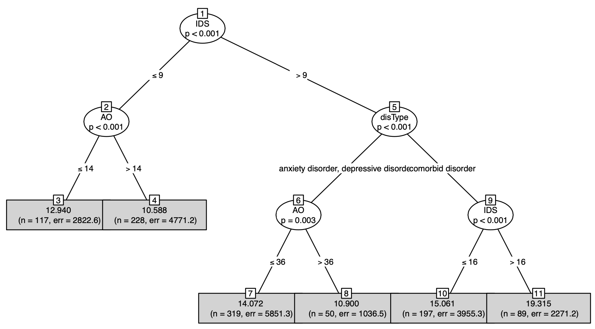
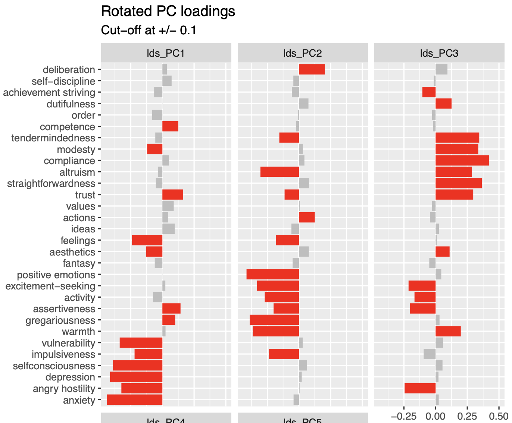
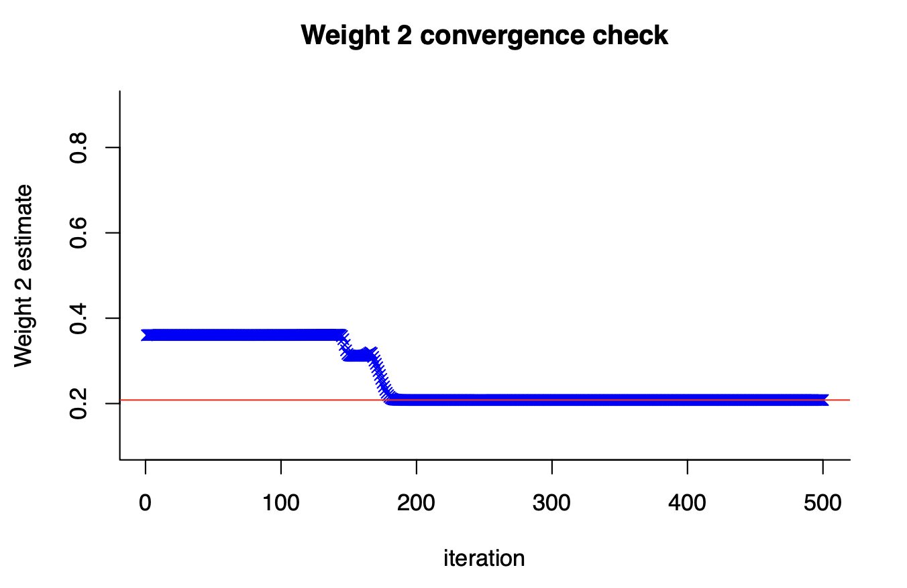
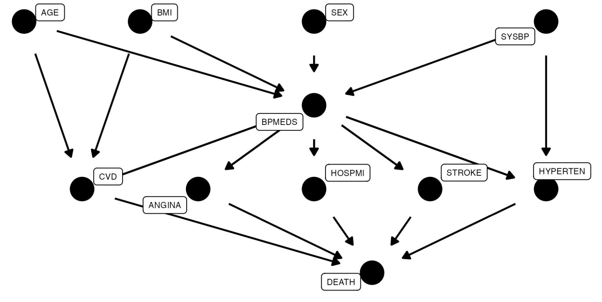

# leiden_public

Welcome to my repository showcasing academic projects from my MSc in Statistics &amp; Data Science program.

# 6 Projects

**CLICK** on the title or preview image to learn more about each project.
  
All projects are written in **R**.
 
Topics: **Machine learning, Causal Inference, data visualization**.

[Project 1](#1-ai-explains-factors-leading-to-depressions): Deep understanding of model selection 
 
[Project 2](#2-hidden-personalities-uncovered-using-ai): Most interesting results
 
[Project 3](#3-crafted-complex-machine-learning-algorithm-from-scratch): More computer science, less statistics
 
[Project 4](#4-will-you-die-if-you-take-blood-pressure-medication): Research and causal inference skills
 
[Project 5](#5-advanced-ggplot-selection) and [6](#6-common-data-visualization-types-summary): Data visualization skills and theory

## Machine Learning Projects

### [1. AI explains factors leading to depressions](https://github.com/ValentinK214/leiden_public/tree/main/Statistical-learning_project-2)

 

### [2. Hidden personalities uncovered using AI](https://github.com/ValentinK214/leiden_public/tree/main/Statistical-learning_project-1)

 

### [3. Crafted complex machine learning algorithm from scratch](https://github.com/ValentinK214/leiden_public/tree/main/SCwR-EM_algo)

## Causal Inference Project

### [4. Will you DIE if you take blood pressure medication?](https://github.com/ValentinK214/leiden_public/tree/main/Causal-inference#will-you-die-if-you-take-blood-pressure-medication)

## Data Viz Projects

### [5. Advanced ggplot selection](https://github.com/ValentinK214/leiden_public/tree/main/SCwR-data_viz-ggplot#advanced-ggplot-selection)

### [6. Common Data Visualization Types Summary](https://github.com/ValentinK214/leiden_public/tree/main/SCwR-data_viz-ggplot#common-data-visualization-types-summary)

