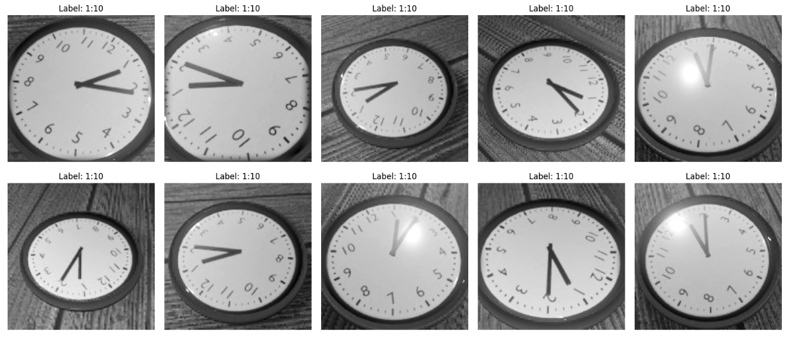
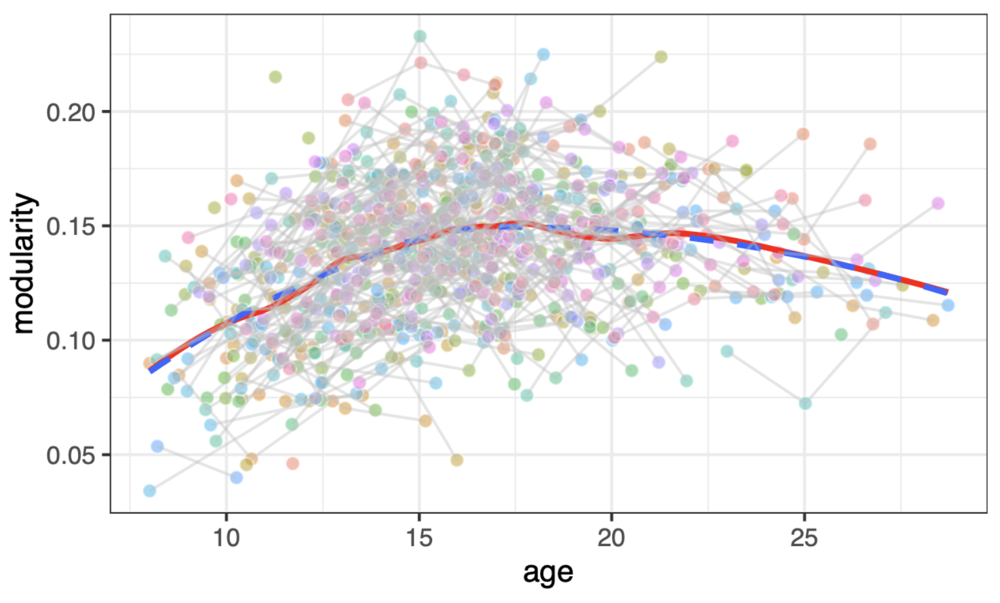
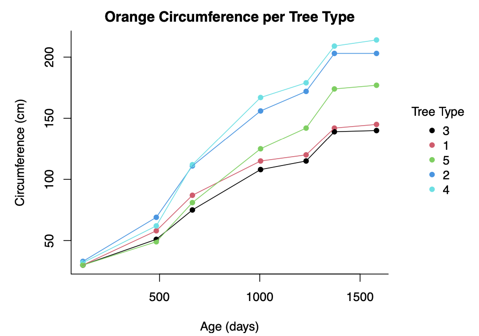

# leiden_public

Welcome to my repository showcasing academic projects from my MSc in Statistics &amp; Data Science program.

# 7 Projects

**CLICK** on the title or preview image to learn more about each project.
 
 
**Topics**: Deep learning, machine learning, causal inference, data visualization
 
**Languages**: Python, R
 

[Project 1](#1-AI-outperforms-humans-on-reading-the-time): Neural networks 
 
[Project 2](#2-ai-explains-factors-leading-to-depressions): Deep understanding of model selection 
 
[Project 3](#3-hidden-personalities-uncovered-using-ai): Most interesting results
 
[Project 4](#4-crafted-complex-machine-learning-algorithm-from-scratch): More computer science, less statistics
 
[Project 5](#5-will-you-die-if-you-take-blood-pressure-medication): Research and causal inference skills
 
[Project 6](#6-advanced-ggplot-selection) and [7](#6-common-data-visualization-types-summary): Data visualization skills and theory

## Deep Learning Project (Python)

### [1. AI outperforms humans on reading the time](https://github.com/ValentinK214/leiden_public/tree/main/deep-learning)

 

## Machine Learning Projects (R)

### [2. AI explains factors leading to depressions](https://github.com/ValentinK214/leiden_public/tree/main/Statistical-learning_project-2)

 

### [3. Hidden personalities uncovered using AI](https://github.com/ValentinK214/leiden_public/tree/main/Statistical-learning_project-1)

 

### [4. Crafted complex machine learning algorithm from scratch](https://github.com/ValentinK214/leiden_public/tree/main/SCwR-EM_algo)

## Causal Inference Project (R)

### [5. Will you DIE if you take blood pressure medication?](https://github.com/ValentinK214/leiden_public/tree/main/Causal-inference)

## Data Viz Projects (R)

### [6. Advanced ggplot selection](https://github.com/ValentinK214/leiden_public/tree/main/SCwR-data_viz-ggplot#advanced-ggplot-selection)

### [7. Common Data Visualization Types Summary](https://github.com/ValentinK214/leiden_public/tree/main/SCwR-data_viz-ggplot#common-data-visualization-types-summary)

