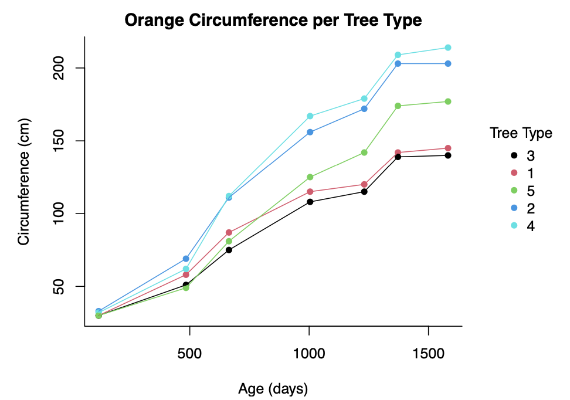
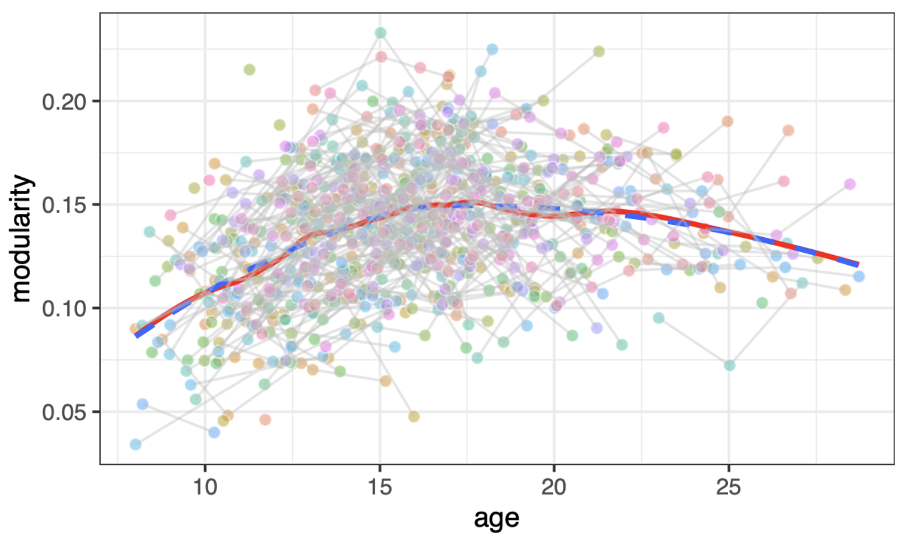

# Data Visualisation Projects

[Project 1](#common-data-visualization-types-summary): General data visualisation types
 
[Project 2](#advanced-ggplot-selection): Advanced visualisations using ggplot

## Common Data Visualization Types Summary

- **Please open:**
  - [Visualization Types Summary (PDF)](https://github.com/ValentinK214/leiden_public/blob/main/SCwR-data_viz-ggplot/all_visualistions_doc.pdf).

- **Description:**
  - This project involves creating a comprehensive document in preparation for the [Statistical Computing with R](https://studiegids.universiteitleiden.nl/en/courses/121707/statistical-computing-with-r) exam. 
  - It covers my interpretation of all uni and bivariate visualization types, plus their group comparisions, using base R.

- **Key Learnings:**
  1. Identified 11 fundamental visualization types, consolidating diverse visualizations into these categories.
  2. Recognized that the primary distinction is the factor variable as it decides if a group comparision is needed or not.
  3. Developed a hyperlinked index for various group comparisons based on the number and type of variables, guiding visualization choices.
  4. Understood that certain visualizations, like box-plots, can be simplified and categorized into the identified 11 types.

- **Interesting Sections from the Report**
    - Introduction: Hyperlink table
    - Conclusion: Personal interpretation

## Advanced ggplot selection

- **Please open:**
  - [ggplot report (PDF)](https://github.com/ValentinK214/leiden_public/blob/main/SCwR-data_viz-ggplot/ggplot_challenges_cheat_sheet.pdf).

- **Description:**
    - Created this selection of advanced ggplot graphics in preperation for the [Data Visualiszation Princples](https://studiegids.universiteitleiden.nl/en/courses/121713/data-visualization) exam.
    - This 6 EC course closely followed [Wilke's Fundamentals of Data Visualization](https://clauswilke.com/dataviz/) textbook.

- **Key Learnings:**
    - Every visualisation starts with a table, where each column (ie. variable) is mapped to a graphical element on the plot via "scales".
    - Most common scales are: position, shape, size, color.
    - Scales are [interchangable](https://clauswilke.com/dataviz/aesthetic-mapping.html)
    - Ranked perceptiual accuracy of scales: Postion -> Length -> Area -> Angle -> Color intensity (Fronconeri 2021)
    - Data to ink ratio (Tufte 1983), proportional ink ratio, redundant encoding
    - 3D plots are bad as they project a 3D object onto a 2D space (ie print out, screen you're using) so there is distortion/information loss

