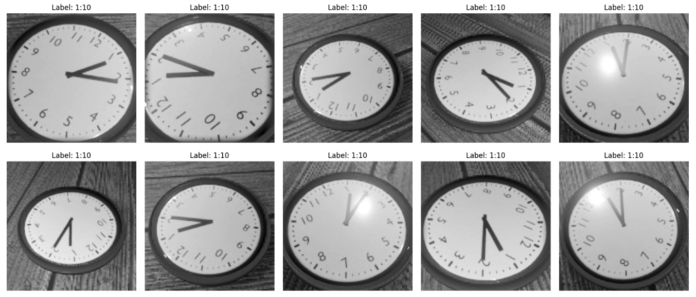

# Deep Learning

This project was part of the [Deep Learning](https://studiegids.universiteitleiden.nl/en/courses/122697/introduction-to-deep-learning) module.
 
The project's goal was to manually build and train a deep learning model to accurately read the time from images of analog clocks.
 
 
Our model was the **#1 performing model in a cohort of 300+ students** and we received a near perfect grade of **9.5/10**.

## AI outperforms humans on reading the time

- **Please open:**
  - [Project report (PDF)](https://github.com/ValentinK214/leiden_public/blob/main/deep-learning/DL_Task_1_Group_Report_Final.pdf) - main file
  - [Assignment Questions)](https://github.com/ValentinK214/leiden_public/blob/main/deep-learning/0_Assignment_questions.pdf)

- **Description:**
  - Build and train a deep learning model (CNN) from scratch using TensorFlow
  - Teach the model to read analog clocks
  - The model must be robust to rotations, different angles and light glare
  - Justify your architecture and loss function choices (e.g. regression vs classification)
  - For detailed information, see the [assignment questions](https://github.com/ValentinK214/leiden_public/blob/main/deep-learning/0_Assignment_questions.pdf). 

- **Achievements:**
  - **#1 performing model in a cohort of 300+ students**
  - Near perfect grade of 9.5/10
  - Model misreads time by only 1.02 minutes (beating us developers on a random subset of high glare + upside down clock pictures)

- **Key Learnings (Technical) :**
    - **Loss Function**: Often the performance measure of interest (common sense time error) is different from the available/trainable loss function (e.g. categorical cross entropy).
    - **Data Augmentation**: Increasing the training set by a factor of 10x via random levels of zoom, shear, glare and rotation significantly improves model performance.
    - **Transfer Learning**: Especially for computer vision tasks, transfer learning can work exceptionally well and is very easy to implement.
    - **CNN Architecture** Follow a rough then fine tune strategy to find the MSE valley. Overfit massively, then underfit massively. Iterate to find the valley.
    - **Rashomon Set**: There exist many hyperparameter and architectural combinations that achieve near Oracle performance.
    - **Python Libraries**: Learned how to work with numpy, pandas, tensorflow, keras and matplotlib.

- **Interesting Sections from the Report**
    - Section 2: Overview of the challenge
    - Section 2.4: Architecture and training choice (transfer learning and augmentation) 
    - Section 2.6: Results
